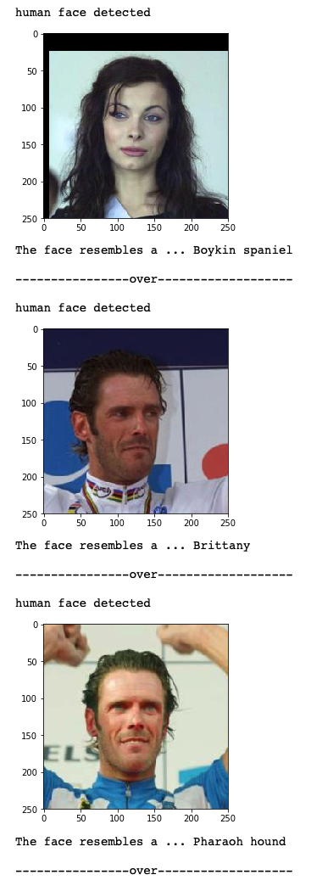
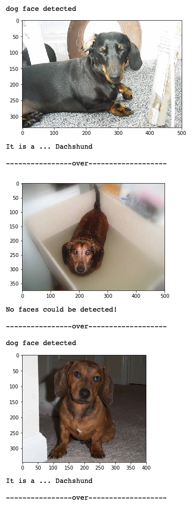

# Dog_Breed_Classifier

## Introduction 
Dog Breed Classifier project is a part of Udacity Deep Learning Nanodegree. In this project, I aimed to build neural network
pipelines to process real-world, user-supplied images. Concretely I built Convolutional Neural Networks (CNN) from scratch 
and applied transfer learning respectively to identify an estimate of the canine's breed in a given image. If supplied an image of a human, the algorithm should identify the resembling dog breed.

## Required Skills :octocat:
1. Understanding of CNN 
2. Transfer learning 
3. Understanding of VGG-16 model
4. Tuning the hyperparameters
5. Setting up an instance on AWS and train the neural network on a GPU

## Test :octocat:
1. Clone this repo to your local computer by running:
* ```git clone https://github.com/JIMLYY/Dog_Breed_Classifier.git```
2. If you have anaconda installed, 
* You can creat a new environment for this project by entering 
```conda create --name deep-learning python=3``` in the command line. 
* Enter your new environment by running:
   - Mac/linux >>```conda activate  deep-learning```  
   - Windows  >>```activate  deep-learning```
* Check the environment file and ensure install all the packages.
* Run the following command to open up the notebook server:
   - ```jupyter notebook```
* Run the cell of jupyter notebook by pressing shift + return/enter

Note: If you do not have anaconda, follow the [instructions in original repo](https://github.com/udacity/deep-learning-v2-pytorch/blob/master/README.md) to set up the environemnt. 

## Demo
### Human faces are provided...

### Dog faces are provided...


## Try it yourself:rocket:
1. If you are new to the neural network, this is a good project to check your unstanding of the basics. The original repo can 
be found at ```https://github.com/udacity/deep-learning-v2-pytorch.git```.
2. Use ```git clone https://github.com/udacity/deep-learning-v2-pytorch.git```
to clone to repo to your local computer.
3. Try to finish the project yourself. 


Cheers:+1:


